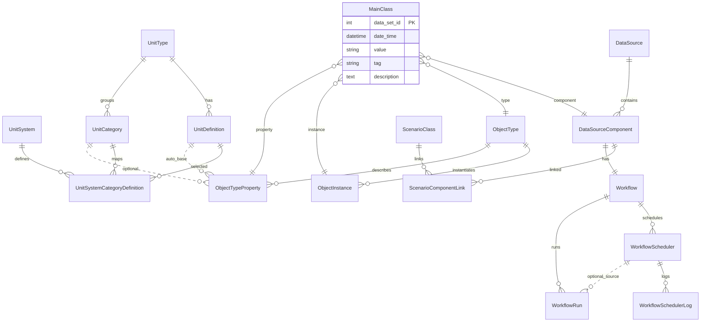

**Overview**
- Domain models live in `backend/mainapp/apiapp/models.py` and back a Django + PostgreSQL service.
- Core areas: Units and categories, Data sources and components, Scenarios, Object taxonomy (type/instance/property), Main time-series facts, and Workflows/scheduling.
- Conventions: explicit `db_table`, audit fields (`created_date`, `modified_date`, some `created_by`), and selective `unique_together` and indexes.

**Entity Catalog**
- UnitSystem (`backend/mainapp/apiapp/models.py:11`)
  - Named unit systems (e.g., Oil Field, SI). Drives default unit selection per category.
  - Key: `unit_system_id`, `unit_system_name` (unique).

- UnitType (`backend/mainapp/apiapp/models.py:33`)
  - Semantic types like Viscosity, Acceleration; parent for unit definitions and categories.
  - Key: `unit_type_id`, `unit_type_name` (unique).

- UnitDefinition (`backend/mainapp/apiapp/models.py:55`)
  - Concrete units with scale/offset and base-flag per type.
  - FKs: `unit_type`. Constraints: unique (`unit_definition_name`, `unit_type`), `is_base` indicates canonical unit.

- UnitCategory (`backend/mainapp/apiapp/models.py:85`)
  - Groups properties into categories tied to a `UnitType` (e.g., Angle, Pressure).
  - FKs: `unit_type`. Constraints: unique (`unit_category_name`, `unit_type`).

- UnitSystemCategoryDefinition (`backend/mainapp/apiapp/models.py:109`)
  - Junction picking the default `UnitDefinition` for each (`UnitSystem`, `UnitCategory`).
  - FKs: `unit_system`, `unit_category`, `unit_definition`. Constraint: unique triple.

- DataSource (`backend/mainapp/apiapp/models.py:135`)
  - Logical source of data: INPUT, OUTPUT, PROCESS.
  - Key: `data_source_name` (unique), `data_source_type` (choices).

- DataSourceComponent (`backend/mainapp/apiapp/models.py:160`)
  - Named component under a `DataSource`; optional file attachment; creator/audit.
  - FKs: `data_source`, `created_by` (Django `User`). Ordered by `-created_date`.

- ScenarioClass (`backend/mainapp/apiapp/models.py:214`)
  - A scenario with lifecycle fields, approval, and audit.
  - FKs: `created_by`. Related logs via `ScenarioLog`.

- ScenarioLog (`backend/mainapp/apiapp/models.py:240`)
  - Timestamped messages and progress for a scenario.
  - FK: `scenario` (cascade), ordered by `timestamp` desc.

- ScenarioComponentLink (`backend/mainapp/apiapp/models.py:252`)
  - Many-to-many association between `ScenarioClass` and `DataSourceComponent`.
  - Constraint: unique (`scenario`, `component`) and validation to prevent multiple components from the same `data_source` per scenario.

- ObjectType (`backend/mainapp/apiapp/models.py:284`)
  - Canonical object taxonomy root (e.g., Well, Compressor).
  - Key: `object_type_id`, `object_type_name` (unique).

- ObjectInstance (`backend/mainapp/apiapp/models.py:298`)
  - Concrete instance under an `ObjectType` (e.g., Well-12).
  - FKs: `object_type`. Key: `object_instance_name` (unique).

- ObjectTypeProperty (`backend/mainapp/apiapp/models.py:313`)
  - Property definition per object type (name, category, external tag `openserver`).
  - FKs: `object_type`, optional `unit_category`, computed `unit` auto-set to base `UnitDefinition` of the category’s `UnitType`.
  - Constraint: unique (`object_type`, `object_type_property_name`).

- MainClass (`backend/mainapp/apiapp/models.py:346`)
  - Fact table for measurements/events: value at `date_time` for (`object_type`, `object_instance`, `object_type_property`) optionally scoped by `component` (thus `data_source`).
  - FKs: `component`, `object_type`, `object_instance`, `object_type_property` (via `ChainedForeignKey` constrained by `object_type`).
  - Fields: `value` (string), `date_time`, optional `tag`, `description`.
  - Properties: `sub_data_source` derived from property category; `data_source` derived from component.
  - Indexes: (`component`), and (`object_type`, `object_type_property`). Pre-save validator ensures `object_instance.object_type == object_type`.

- Workflow (`backend/mainapp/apiapp/models.py:420`)
  - One-to-one with `DataSourceComponent`. Stores notebook cell JSON and exported `code_file`/`ipynb_file` paths. `python_code` convenience property.

- WorkflowScheduler (`backend/mainapp/apiapp/models.py:450`)
  - Cron-like scheduling for a `Workflow`; tracks `next_run`, `last_run`, `is_active`, audit.

- WorkflowSchedulerLog (`backend/mainapp/apiapp/models.py:474`)
  - Status log entries per schedule with message and timestamp.

- WorkflowRun (`backend/mainapp/apiapp/models.py:493`)
  - Execution record for a workflow (optionally linked to a scheduler): Celery `task_id`, start/finish times, status, stdout/err.

- GapNetworkData (`backend/mainapp/apiapp/models.py:517`)
  - Stores global network topology for a well: `paths`, `branches`, `trunks` JSON; audit timestamp.

**Relationships**
- Units
  - `UnitType` 1—* `UnitDefinition` (with a single base per type).
  - `UnitType` 1—* `UnitCategory`.
  - (`UnitSystem`, `UnitCategory`) —> `UnitDefinition` via `UnitSystemCategoryDefinition` unique triple.
- Data Sources
  - `DataSource` 1—* `DataSourceComponent`.
  - `ScenarioClass` *—* `DataSourceComponent` via `ScenarioComponentLink` (unique per component within scenario and one-per-data-source enforced in `clean()`).
- Object Model
  - `ObjectType` 1—* `ObjectInstance`.
  - `ObjectType` 1—* `ObjectTypeProperty` (unique names per type).
  - `ObjectTypeProperty` -> optional `UnitCategory` -> base `UnitDefinition` auto-assigned to `unit` field.
- Main Facts
  - `MainClass` references: `component` -> `DataSource` (implicit), `object_type`, `object_instance` (validated to match type), `object_type_property` (chained to the same type).
- Workflows
  - `DataSourceComponent` 1—1 `Workflow` 1—* `WorkflowScheduler` 1—* `WorkflowSchedulerLog` and 1—* `WorkflowRun` (runs may also link back to scheduler).

**Storage and Tables**
- Every model specifies `db_table` under `apiapp_*` names for clear DB separation.
- Audit
  - Common: `created_date`/`modified_date`, some models carry `created_by` and `modified_by` or `is_active`.
- Indexes
  - `MainClass` has indexes on `component` and (`object_type`, `object_type_property`) for common query patterns.
- Files
  - `DataSourceComponent.file`, `Workflow.code_file`, `Workflow.ipynb_file` store paths under `media/` per Django configuration; workflow paths are keyed by component id.

**Access Patterns**
- Fact queries
  - Filter `MainClass` by `component` and property tuple (`object_type`, `object_type_property`); time-range over `date_time` when present.
  - Derive `data_source` from `component` without extra join via property.
- Scenario data
  - For a scenario, join `ScenarioComponentLink` to list components; validation prevents duplicates by data source.
- Units resolution
  - Given an `ObjectTypeProperty.unit_category`, default `unit` auto-resolves to the category’s base unit for straightforward conversions.
- Workflows
  - `WorkflowScheduler` drives asynchronous runs (Celery `task_id` recorded on `WorkflowRun`), with logs for observability.

**Validation and Constraints**
- `MainClass` pre-save ensures instance/type consistency: `object_instance.object_type == object_type`.
- `ScenarioComponentLink.clean()` disallows two components from the same `DataSource` in one scenario.
- `ChainedForeignKey` on `MainClass.object_type_property` restricts selectable properties to those belonging to the chosen `object_type`.

**Notes and Conventions**
- Users: `created_by` FKs target `django.contrib.auth.models.User` where present.
- Time: `DateTimeField` used broadly for audit and events; consider timezone-awareness via Django settings.
- JSON fields: used for notebook cells and network topology for flexibility without extra tables.

**Suggested ER Sketch (conceptual)**
`UnitType` --< `UnitDefinition`
`UnitType` --< `UnitCategory` --< `UnitSystemCategoryDefinition` >-- `UnitSystem`

`DataSource` --< `DataSourceComponent` --1 `Workflow` --< `WorkflowScheduler` --< `WorkflowSchedulerLog`
                                                       \
                                                        --< `WorkflowRun`

`ObjectType` --< `ObjectInstance`
`ObjectType` --< `ObjectTypeProperty` --? `UnitCategory` --< `UnitDefinition`

`MainClass` - - - references: (`DataSourceComponent`, `ObjectType`, `ObjectInstance`, `ObjectTypeProperty`)

**Mermaid ER Diagram**

Rendered Diagram
- 
- Links: [SVG](model-data-architecture.svg) | [PNG](model-data-architecture.png)

**Appendix: Key File References**
- Models: `backend/mainapp/apiapp/models.py`
- Serializers/Views (API surface): `backend/mainapp/apiapp/serializers.py`, `backend/mainapp/apiapp/views/`
- Migrations: `backend/mainapp/apiapp/migrations/`
